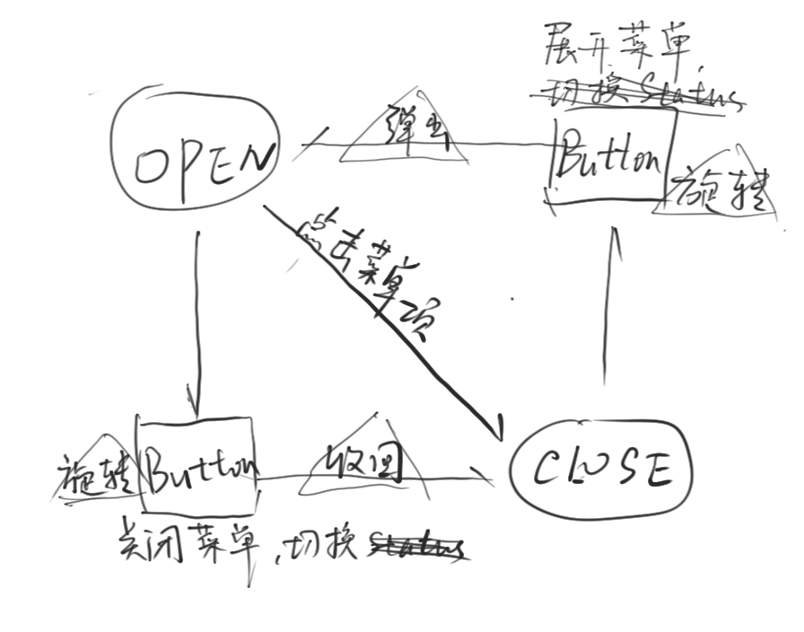

#### ArcMenu
***
###### 需求分析
1. 显示在屏幕上四角之一，默认关闭
2. 点击展开，再点关闭
3. 半径，菜单项数目可调
4. 菜单项可响应点击事件

###### 状态转移

差不多是这样

其他就是切换过程的动画了

**注意**：dp向px的转换方法，用三角函数计算菜单项位置，提供Listener接口处理点击事件。
***
###### 没解决的难题

1. 在ArcMenu.class中使用了resId(main button)，耦合较高
2. 菜单项位于mainButton之上，展开时突然出现很尴尬

###### 这次写的比较简单
很久之前初次接触自定义ViewGroup的时候就做了这个，这次上传时间比较紧迫，没有做出修改。

感谢hongyang大神。
